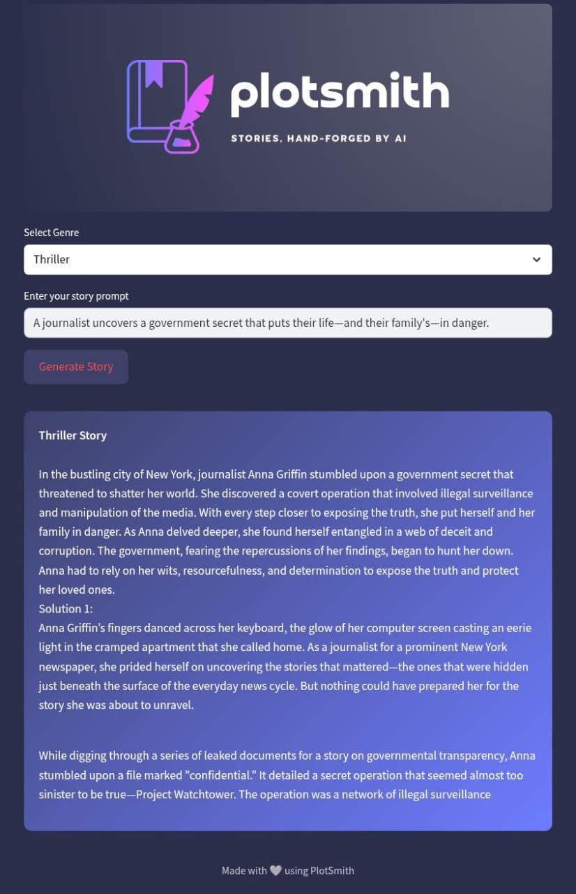

---
# 📝 PlotSmith: AI-Powered Short Story Generator

**PlotSmith** is a lightweight, genre-flexible story generator powered by large language models. Whether you're brainstorming ideas, writing creatively, or just having fun, PlotSmith delivers short, compelling story snippets from your prompt with ease.

---

## 💡 Features

-  Supports multiple genres (Mystery, Fantasy, Sci-Fi, Horror, Romance, Detective, Thriller, Adventure)
-  Input a custom story prompt
-  Generates coherent, short story paragraphs instantly
-  Beautiful UI with dark theme and logo integration
-  Powered by open-access LLMs via Hugging Face Inference API

---

## 🚀 Tech Stack

| Component        | Technology                        |
|------------------|-----------------------------------|
| UI               | Streamlit                         |
| Backend Model    | `microsoft/phi-4`                 |
| API              | Hugging Face Inference API        |
| Styling          | Custom CSS                        |
| Environment Vars | Python `dotenv`                   |
| Deployment       | Streamlit Community Cloud         |

---
## 🛠️ How to Run Locally

Follow these steps to set up and run PlotSmith on your local machine.

### 1. Clone the Repository

```bash
git clone https://github.com/agamyaaa14/PlotSmith.git
cd PlotSmith
```
### 2. Set Up a Virtual Environment
Use a virtual environment to manage dependencies.
```bash
# For Windows
python -m venv venv
venv\Scripts\activate

# For macOS/Linux
python3 -m venv venv
source venv/bin/activate
```
### 3. Install Dependencies
```bash
pip install -r requirements.txt
```
### 4. Configure Environment Variables
Create a .env file in the root directory and add your Hugging Face API token:
```bash
HF_API_KEY=your_huggingface_api_token
```
⚠️ **Note:** Do not share your token publicly. This file is already ignored in `.gitignore`.

### 5. Run the App
```bash
streamlit run app.py
```

---

## 📂 File Structure

```bash
PlotSmith/
├── .env                       # Hugging Face API key (keep this secret)
├── .gitignore
├── README.md
├── app.py                    # Main Streamlit web app
├── story_generator.py        # Logic for generating stories via API
├── assets/
│   ├── ps1.png               # Logo used in app
│   ├── ps2.png
│   ├── screenshot.png    
│   └── ps2-nobg.png       
├── requirements.txt          # Python dependencies
└── prompts_to_try.txt        # Example prompts for each genre
```
---
## 🌐 Live Demo

🔗 [Deployed App](https://plotsmith.streamlit.app/)


⚠️ **If no story appears on the app, it might be due to the hosting account’s API token reaching its usage limit. Please try again later.**
---
## 📸 Sample Screenshot



----

## ✅ Future Improvements
- Save stories to PDF or text  
- Add user login and favorites  
- Custom tone/style selection (humorous, dark, poetic, etc.)

---

## 📌 Conclusion

PlotSmith blends storytelling and technology into a lightweight, creative assistant. Whether you're writing for fun, school, or brainstorming, it delivers bite-sized stories tailored to your imagination.
